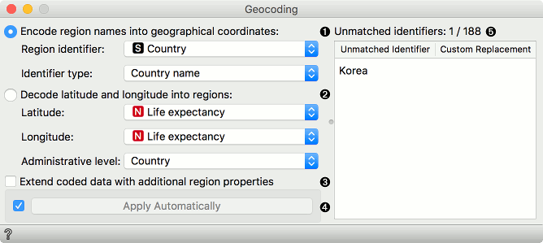
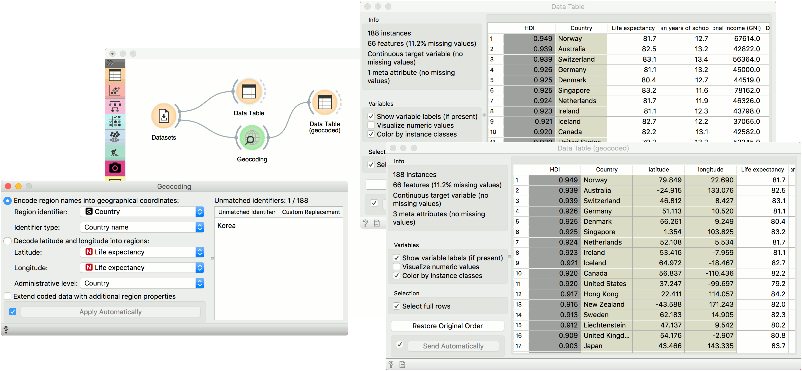

Geocoding
=========

Encode region names into geographical coordinates, or reverse-geocode latitude and longitude pairs into regions.

**Inputs**
-  Data: An input data set.

**Outputs**
-  Coded Data: Data set with new meta attributes.

**Geocoding** widget extracts latitude/longitude pairs from region names or synthesizes latitude/longitude to return region name. If the region is large, say a country, encoder with return the latitude and longitude of geometric centre.

1. Use region names to extract the corresponding latitude/longitude pairs:
   - Region identifier: attribute with the information on region names. Can be discrete or string.
   - Identifier type: define how the data is coded. Supports ISO codes and some major cities and countries.
2. Use latitude and longitude pairs to retrieve region names:
   - Latitude attribute.
   - Longitude attribute.
   - Administrative level of the region you wish to extract.
3. Extend coded data adds additional information on the region of interest. For countries, for example, one would get economy, type, continent, etc.
4. If *Apply Automatically* is ticked, the changes will be communicated automatically. Alternatively, press *Apply*.
5. Unmatched identifiers editor. Match regions names that couldn't be matched automatically with their corresponding name.

Example
-------

We will use *HDI* data from the **Datasets** widget. Open the widget, find *HDI* data, select it and press *Send*. First, let us observe the data in a **Data Table**. We have a meta attribute names *Country*, which contains country names. Now we would like to plot this on a map, but **Geo Map** widget requires latitude and longitude pairs. **Geocoding** will help us extract this information from country names.

Connect **Geocoding** to **Datasets**. Region identifier in our case is the attribute *Country* and the identifier type is *Country name*. If our data contained major European cities, we would have to select this from the dropdown. On the right there is the *Unmatched identifier* editor, which shows those instances, for which **Geocoding** couldn't find corresponding latitude/longitude pairs. We can help the widget by providing a custom replacement. Click on the field and start typing *Korea*. The widget will suggest two countries, Democratic Republic of Korea and South Korea. Select the one you wish to use here.

Finally, we can observe the data in the second **Data Table**. We can see our data now has two additional attributes, one for the latitude and one for the longitude of the region of interest. Now, you can plot the data on the map!

