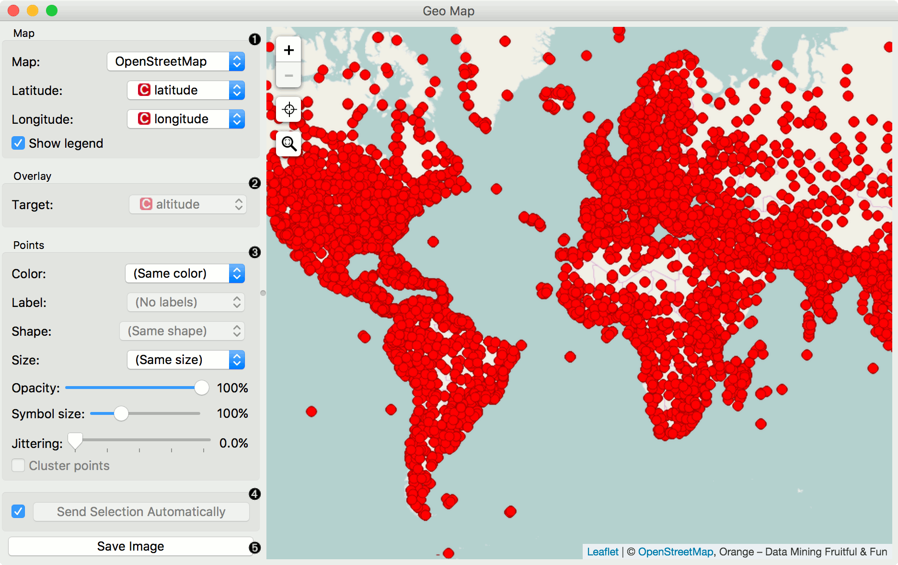

Geo Map
=======

Show data points on a map.

**Inputs**

- Data: input dataset
- Data Subset: subset of instances

**Outputs**

- Selected Data: instances selected from the plot
- Data: data with an additional column showing whether a point is selected

**Geo Map** widget visualizes geo-spatial data on a map. It works on datasets containing latitude and longitude variables in WGS 84 (EPSG:4326) format. We can use it much like we use Scatter Plot widget.

 

1. Set the type of map: [OpenStreetMap](http://www.openstreetmap.org), Black and White, Topographic, Satellite, Print, Dark.
2. Set latitude and longitude attributes, if the widget didn't recognize them automatically. Latitude values should be between -85.0511(S) and 85.0511(N) (a limitation of the projections onto flat maps) and longitude values between -180(W) and 180(E).
3. Set color, shape, size and label to differentiate between points. Set symbol size, opacity and jittering for all data points.
4. Adjust *plot properties*:
   - *Show color region* colors the graph by class (color must be selected).
   - *Show legend* displays a legend on the right. Click and drag the legend to move it.
   - *Freeze map* freezes the map so it doesn't update when input data changes.
5. *Select, zoom, pan and zoom to fit* are the options for exploring the graph. The manual selection of data instances works as an angular/square selection tool. Scroll in or out for zoom.
6. If *Send automatically* is ticked, changes are communicated automatically. Alternatively, press *Send*.

Examples
--------

In this simple example we visualize the *Philadelphia Crime* dataset that we can find in the **Datasets** widget. We connect the output of that widget to the **Map** widget. Latitude and longitude variables get automatically detected and we additionally select the crime type variable for color. We can observe how different crimes are more present in specific areas of the city. 

