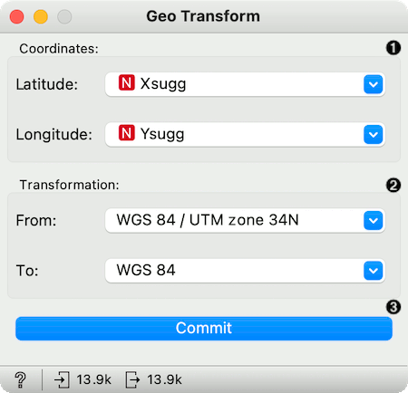
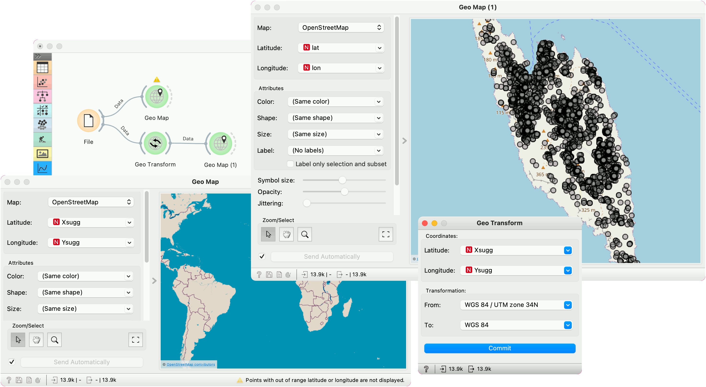

Geo Transform
=============

Transform geographic coordinates from one system to another.

**Inputs**

- Data: input dataset

**Outputs**

- Data: data with transformed coordinates.

**Geo Transform** widget converts latitude and longitude data from one geodesic system to another. It uses [pyproj](https://pyproj4.github.io/pyproj/stable/) library for the conversion.

1. Set latitude and longitude attributes, if the widget didn't recognize them automatically.
2. Geodesic systems used for transformation. By default, the output system is set to the latest revision of the World Geodesic System, WGS 84.
3. Press *Commit* to apply the transformation.

Example
-------

For the example, we will use the Antikythera data, an archaeological dataset describing the shards found on the Greek island Antikythera. The dataset can be found [here](https://archaeologydataservice.ac.uk/catalogue/adsdata/arch-1115-2/dissemination/csv/pottery/pottery.csv&hs=true). We will use the easy way and simply copy-paste the URL of the data into the URL line of the [File](https://orangedatamining.com/widget-catalog/data/file/) widget.

https://archaeologydataservice.ac.uk/catalogue/adsdata/arch-1115-2/dissemination/csv/pottery/pottery.csv&hs=true

Latitude and longitude are encoded in the *Xsugg* and *Ysugg* variables. But if we plot these variables, we cannot see anything in the [Geo Map](geomap.md). The widget raises a warning stating the points are outside the specified range for the map.

This is because the data is encoded in the WGS 84 / UTM zone 34N system (EPSG:32634). Geo Transform can convert the data from the original system to the standard WGS 84, which Geo Map is using. After we set the correct system for transformation, we press *Commit* to output the data.

In the second Geo Map, we can see the data is now plotted correctly. All the found shards are placed on the Antikythera island.

